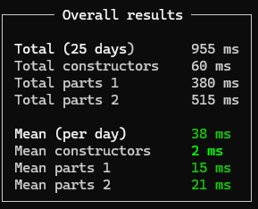

# AdventOfCode.Template


Advent of Code template based on [AoCHelper](https://github.com/eduherminio/AoCHelper) project.

It allows you to focus on solving AoC puzzles while providing you with some performance stats.

Output example:


## Notes
- Not all the solutions are optimal, but overall the goal for this year was to have all 25 days running in under 1s in release mode, which has been accomplished:

    

- A note on the leaderboard below, some times are subject to estimates, as not full focus was on the AoC during that time (each day's problem came out at 7am, with normal workday and meetings)
- Please note that the input's for each day are not included, to get the inputs, please head over to [Advent Of Code](https://adventofcode.com) for year 2024

Final Leaderboard standings:

```
      --------Part 1--------   --------Part 2--------
Day       Time   Rank  Score       Time   Rank  Score
 25   00:16:44   1823      0   00:16:49   1473      0
 24   00:22:32   1719      0   01:50:05    568      0
 23   00:48:23   3947      0   01:07:56   2886      0
 22   00:42:28   4096      0   01:15:58   2773      0
 21   02:19:04   1965      0   02:29:41    915      0
 20   00:24:50   1025      0   01:42:22   2590      0
 19   01:04:19   5342      0   01:06:30   4084      0
 18   01:20:03   5978      0   01:43:03   5973      0
 17   00:26:50   1719      0   02:37:59   2155      0
 16   02:38:22   6698      0   02:53:15   4363      0
 15   01:06:43   5285      0   02:48:45   4152      0
 14   00:46:31   5143      0   00:52:02   2213      0
 13   00:37:33   4117      0   01:32:23   4417      0
 12   00:39:07   4488      0   02:04:29   4366      0
 11   00:35:17   7966      0   01:32:55   6650      0
 10   00:31:57   5013      0   00:35:03   4477      0
  9   01:06:57   7749      0   03:45:55   9518      0
  8   00:47:14   6155      0   01:10:45   6550      0
  7   01:08:40   8863      0   01:17:25   7886      0
  6   00:34:22   6622      0   01:45:39   6624      0
  5   00:14:04   2433      0   01:37:49  10235      0
  4   03:57:58  26434      0   04:28:52  23660      0
  3   00:13:44   5923      0   00:24:56   4808      0
  2   00:17:28   5972      0   00:37:25   5743      0
  1   00:09:15   3975      0   00:13:47   3884      0
```
